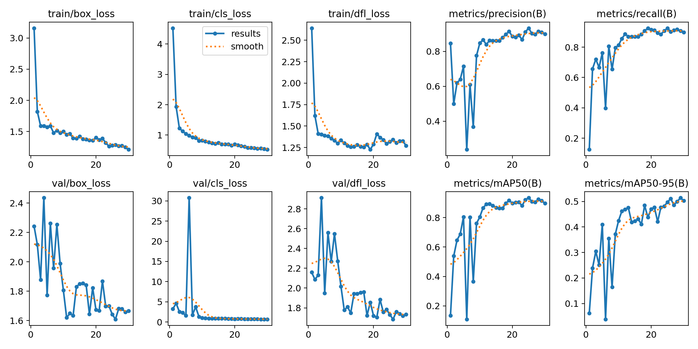
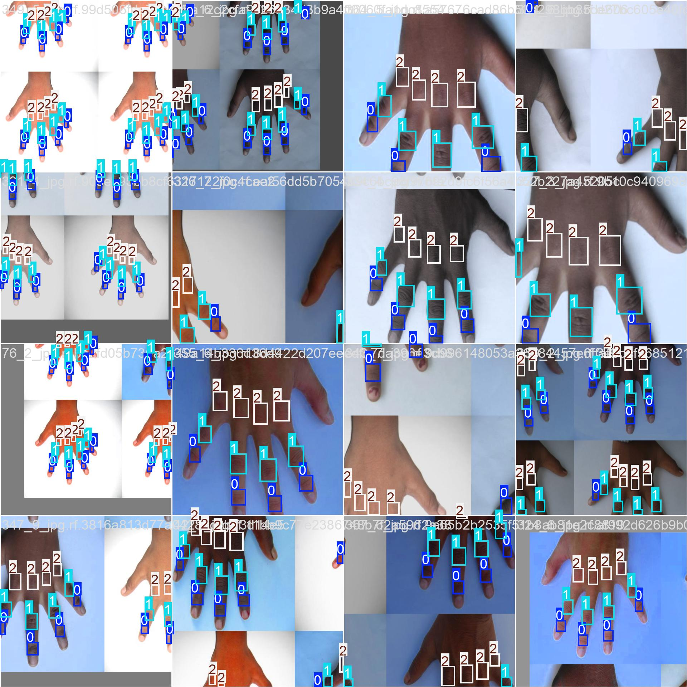
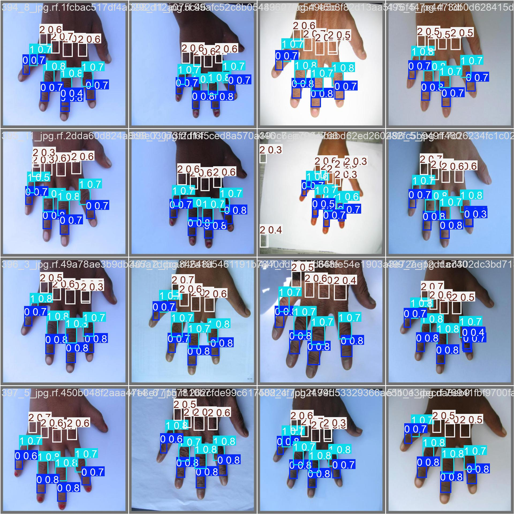

<h1 align="center">🖐️ Knuckle Localization using YOLOv12</h1>

<p align="center">
  
  
  
  
  
</p>

<p align="center">
  A deep learning-based <strong>knuckle localization system</strong> using YOLOv12 for real-time hand biometric detection — applicable in authentication systems, access control, and identity verification.
</p>

---

## 📌 Project Overview

Knuckle patterns are a reliable biometric trait used for **human identification and authentication**. This project implements an end-to-end object detection pipeline using **Ultralytics YOLOv12** to precisely localize knuckles on both left and right hands.

The system is designed to serve as the foundational detection module in larger biometric pipelines — such as smartphone unlock systems, entry-gate authentication, or forensic identification.

---

## 🎯 Problem Statement

Security is a fundamental human need. Traditional biometric systems (fingerprints, face recognition) have well-known vulnerabilities. **Knuckle-based biometrics** offer a less invasive, highly unique alternative that can be integrated into everyday devices like phones, laptops, and tablets.

This project addresses the first and most critical step: **accurately localizing knuckle regions** in real-time from hand images using modern object detection techniques.

---

## 🧠 Key Features

- ✅ Real-time knuckle detection using **YOLOv12 (Ultralytics)**
- ✅ Handles both **left and right hands**
- ✅ Custom dataset with labeled knuckle bounding boxes
- ✅ Training, validation, and inference pipelines included
- ✅ Designed as a modular component for full biometric systems
- ✅ Notebook-ready — runs on **Google Colab / Jupyter**

---

## 🛠️ Tech Stack

| Tool / Library | Purpose |
|---|---|
| Python 3.x | Core programming language |
| Ultralytics YOLOv12 | Object detection model |
| OpenCV | Image processing |
| PyTorch | Deep learning backend |
| Jupyter Notebook | Development & experimentation |
| Roboflow / Custom Dataset | Data labeling and management |

---

## 📁 Repository Structure
```
Knuckle_localization_using_yolov12/
│
├── Knuckle_localization.ipynb   # Main training & inference notebook
├── data.yaml                    # Dataset config (classes, paths)
├── datas.zip                    # Sample labeled dataset
├── results.png
├── train_batch0.jpg
├── val_batch0_pred.jpg                 # Training performance metrics
└── README.md
```

---

## 📊 Results

### Training & Validation Metrics







The model demonstrates strong bounding box localization performance across training and validation sets, with consistent convergence in loss curves and high mAP scores.

---

## 🚀 Getting Started

### 1. Clone the Repository
```bash
git clone https://github.com/krutipandy/Knuckle_localization_using_yolov12.git
cd Knuckle_localization_using_yolov12
```

### 2. Install Dependencies
```bash
pip install ultralytics opencv-python
```

### 3. Extract Dataset
```bash
unzip datas.zip
```

### 4. Run the Notebook
Open `Knuckle_localization.ipynb` in Jupyter or Google Colab and run all cells.

### 5. Train the Model
```python
from ultralytics import YOLO

model = YOLO("yolov12n.pt")
model.train(data="data.yaml", epochs=50, imgsz=640)
```

### 6. Run Inference
```python
results = model("path/to/hand_image.jpg")
results[0].show()
```

---

## 📂 Dataset

The custom dataset includes annotated hand images with bounding boxes around individual knuckle joints for both left and right hands.

- **Format:** YOLO format (`.txt` labels)
- **Classes:** Knuckle regions (left hand, right hand)
- **Source:** Custom collected and labeled dataset (included as `datas.zip`)

---

## 🔭 Future Work

- [ ] Integrate **instance segmentation** (YOLOv12-seg) for pixel-level knuckle masks
- [ ] Build a full **biometric authentication pipeline** using knuckle embeddings
- [ ] Deploy as a **real-time web application** using FastAPI + Streamlit
- [ ] Extend to **3D knuckle reconstruction** using depth cameras
- [ ] Benchmark against other biometric modalities (fingerprint, iris)

---

## 💡 Applications

- 🔐 Device unlock & user authentication
- 🏢 Smart entry-gate access control
- 🕵️ Forensic human identification
- 🏥 Contactless biometric systems (hospital/healthcare)
- 📱 Mobile biometric integration

---

## 👩‍💻 Author

**Kruti Pandya**  
AI/ML Engineer | Computer Vision Enthusiast  

[](https://github.com/krutipandy)


<p align="center">⭐ If you found this project useful, please consider giving it a star!</p>
